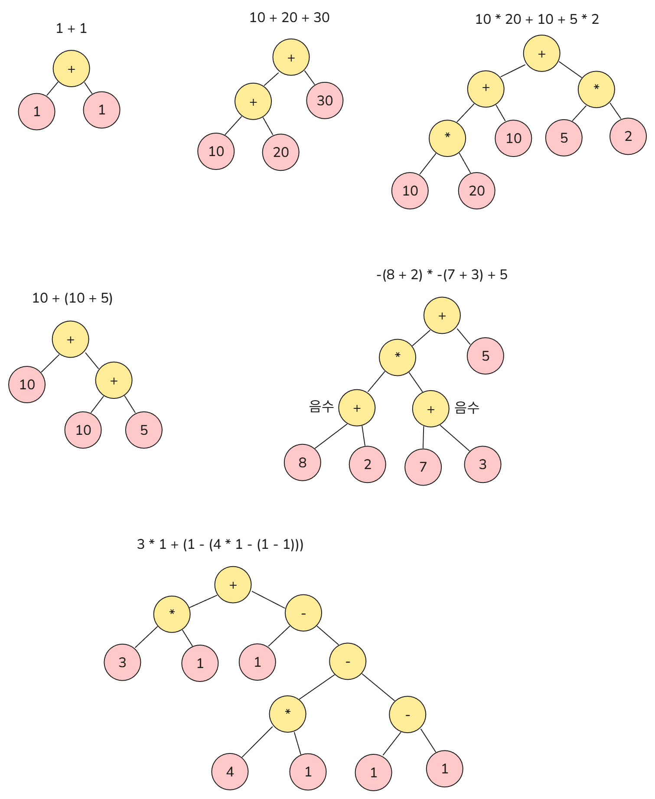
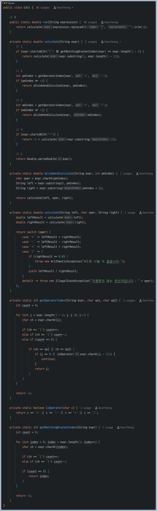

# 자바로 구현하는 다항식 계산기

## ✅ 요구사항

- 재귀 함수로 다항식 계산을 구현해야 합니다.
- 계산 순서는 사칙연산 순서를 정확히 지켜야 합니다. (괄호, 곱셈, 나눗셈 선계산)
- TDD의 싸이클(red, green, blue)을 준수하면서 테스트 코드를 통과해야 합니다.

---

## 🧩 해결 과정

우선 재귀 호출이 어떤 식으로 호출 되어야 할지 트리 형태로 분석해 보았습니다. 
그 결과 다음과 같은 구조를 확인할 수 있었습니다.

- 리프 노드에 속하는 값들이 재귀 호출의 기저 조건으로 더 이상 계산할 수 있는 식이 아니라 하나의 숫자면 재귀를 종료해야 합니다.
- 재귀 호출이 종료되고 자식 노드에서 값을 리턴하면 부모 노드는 자신을 연산자, 두 자식 노드의 값을 피연산자로 두고 계산하여 다시 리턴합니다.
- 이런 식으로 루트 노드까지 계산되면 모든 다항식이 계산됩니다.

---

## 🚀 코드 구현

### 0 
- 초기 다항식을 시작으로 재귀 함수를 시작합니다.
- 계산의 통일성과 편의를 위해 공백은 모두 제거한 채로 시작합니다.

### 1
- 현재 계산식이 괄호로 감싸져 있는 경우를 의미합니다.
- 이 경우 괄호 안에 있는 식만 계산하면 되므로 괄호 내부의 식만 잘라내어 재귀 호출합니다.
- `getMatchingBracketIndex()` 메서드는 계산식의 가장 앞 여는 괄호와 맞는 위치에 있는 닫는 괄호의 위치를 반환합니다. 
  - ex) `getMatchingBracketIndex("(1+1)*(3-1)") == 4`
  - ex) `getMatchingBracketIndex("(2+3)") == 4`
- 위 예시처럼 둘 다 4를 반환하지만 첫 번째는 곱셈을 기준으로 한번 더 나뉘어져야 하므로 여기서 리턴하지 않고, 두 번째는 괄호 안의 식만 계산하여 반환하면 되므로 리턴합니다.

### 2
- 덧셈 또는 뺄셈을 기준으로 식을 나누어야 할 위치를 찾습니다. `pmIndex`는 분리해야 할 덧셈 또는 뺄셈의 위치를 의미합니다.
- `getOperatorIndex()` 메서드는 오른쪽에서 왼쪽으로 분리해야 할 위치를 찾습니다. **오른쪽에서 왼쪽인 이유는 사칙연산의 계산 순서 때문입니다.**
- 수학 계산은 보통 왼쪽에서 오른쪽 순서로 이루어집니다. 예를 들어 `1 - 2 - 3`이 있을 때 `(1 - 2) - 3 == -4` 순서로 계산이 되어야 합니다. 만약 오른쪽을 먼저 계산하면 `1 - (2 - 3) == 2`로 
완전히 잘못된 결과가 나옵니다.
- 즉 오른쪽에서 왼쪽 순서로 찾아야 **먼저 연산이 되어야 할 앞쪽의 계산식**과 나중에 계산되어야 할 뒷쪽의 계산식을 정확하게 구분할 수 있습니다.
- 이때 뺄셈을 주의해야 합니다. 뺄셈은 마이너스 부호로도 사용할 수 있기 때문에 분리해야 할 위치로 판단하면 안 됩니다. (`if (i == 0 || isOperator(expr.charAt(i - 1)))` 부분이 판별 로직입니다.)
- 또한 괄호는 괄호 안의 식끼리 따로 계산이 되어야 하므로 `count` 변수로 괄호 바깥의 연산자인지 구분합니다.
- **덧셈이나 뺄셈을 곱셈이나 나눗셈보다 먼저 분리하는 것도 중요 포인트입니다.** 덧셈과 뺄셈을 먼저 분리해야 사칙연산 계산 순서에 맞게 곱셈과 나눗셈 계산이 먼저 이루어집니다.
- 분리해야 할 덧셈 또는 뺄셈을 찾았다면 [해결 과정](https://github.com/geun-00/calculator?tab=readme-ov-file#-%ED%95%B4%EA%B2%B0-%EA%B3%BC%EC%A0%95)에서 보았던 것처럼 왼쪽 자식과 오른쪽 계산해 피연산자로 두고 `pmIndex` 위치에 있는 연산자에 따라 결과를 반환합니다. 

### 3
- 2번 과정과 같습니다.
- 2번 과정에서는 연산의 우선순위가 낮은 덧셈과 뺄셈을 기준으로 먼저 분리하였고, 그 이후에 3번 과정에서 연산의 우선순위가 높은 곱셈과 나눗셈을 기준으로 분리하는 것이 차이입니다.

### 4
- 사칙연산으로 분리할 수 없고 마이너스 부호가 같은 단일 연산 또는 괄호를 의미합니다.
- 예를 들어 `-3` 이나 `-(1 + 3)`과 같은 경우입니다.
- 마이너스 부호이므로 앞에 마이너스를 제외한 뒤 계산식의 결과값에 -1을 곱하여 리턴합니다.

### 5
- 재귀 함수의 기저 조건으로 계산식에서 하나의 숫자만 남은 경우를 의미합니다.
- 하나의 숫자만 있으므로 계산할 필요 없이 바로 숫자로 변환하여 리턴합니다.
- 나눗셈의 정확한 계산을 위하여 `double`로 변환합니다.

---

### 🤔 고려해 볼만한 사항들

- [ ] 잘못된 다항식 판별
- [ ] 객체 지향적으로 인터프리터 패턴 도입
  - 규모에 비해 클래스가 많아질 수는 있음

---

## ✏️ 회고

사칙연산 순서, 괄호, 마이너스 부호를 모두 고려해야 해서 쉽지 않은 문제였습니다.
다항식도 결국 먼저 계산해야 할 부분을 계산하고 나머지 부분과 계산하면서 합쳐지는 과정이므로 
DP 알고리즘 문제를 해결하듯이 작은 문제부터 풀기 위해 노력했던 것 같습니다.

재귀 함수 구조 이해와 코드 구현 역량을 강화할 수 있는 좋은 문제였다고 생각합니다.
